<p align="center">
  
</p>

# GitHub Cyber City

A lightweight cyberpunk 3D city experience built with **Next.js**, **TypeScript**, **Three.js** and **React Three Fiber**.

Current version renders an optimized demo city with **100 developer towers**, animated neon lights, mobile touch controls and smooth helicopter-style camera movement.

---

## Features

- 100 procedural developer towers
- Black + cyan + electric blue cyberpunk theme
- Mobile-first controls
  - left joystick for movement
  - right side drag for camera look
  - altitude buttons
- Desktop controls
  - WASD movement
  - mouse drag look
  - Space / Shift for up / down
- Animated building lights with dim-to-high sparkle effect
- Canvas minimap
- Optimized instanced rendering for smooth performance

---

## Controls

### Desktop

| Action | Control |
|---|---|
| Move forward / back | W / S |
| Move left / right | A / D |
| Move up | Space |
| Move down | Shift |
| Look around | Mouse drag |

### Mobile

| Action | Control |
|---|---|
| Move | Left joystick |
| Look around | Drag anywhere on screen |
| Move up | ▲ button |
| Move down | ▼ button |

---

## Tech Stack

- Next.js
- React
- TypeScript
- Tailwind CSS
- Three.js
- React Three Fiber

---

## Quick Start

```bash
npm install
```

```bash
npm run dev
```

Open:

```txt
http://localhost:3000
```

---

## Production Build

```bash
npm run build
```

```bash
npm start
```

---

## Project Structure

```txt
app/
  layout.tsx
  page.tsx
  globals.css

components/
  CityScene.tsx
  city/
    DemoCity.tsx
  controls/
    CameraRig.tsx
    TouchControls.tsx
  ui/
    Hud.tsx
    Minimap.tsx

lib/
  demoCity.ts
```

---

## Customization

### Change tower count

Edit `components/CityScene.tsx`:

```ts
const data = useMemo(() => generateDemoCity(100), []);
```

Change:

```ts
generateDemoCity(100)
```

to:

```ts
generateDemoCity(200)
```

or any other count.

---

### Change city grid size

Edit `lib/demoCity.ts`:

```ts
const GRID = 12;
```

Higher value = larger city grid.

---

### Change colors

Main colors are used in:

```txt
lib/demoCity.ts
components/city/DemoCity.tsx
components/ui/Hud.tsx
header.svg
```

Keep the palette strict:

```txt
BLACK
DARK GREY
CYAN
ELECTRIC BLUE
SUBTLE WHITE
```

---

## Note

This version uses procedural demo data for the city.

Real GitHub API integration can be added later to generate buildings from actual repositories, commits, stars and activity.
